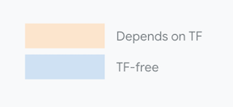

# Orbax Model

Orbax Model (OBM) is the next-generation framework-agnostic export and serialization library for [JAX](https://jax.readthedocs.io/en/latest/) model export (and later, for PyTorch). It can be used as an alternative to [TensorFlow SavedModel](https://www.tensorflow.org/guide/saved_model). 

---

## Table of Contents

1. [Introduction](#introduction)
2. [Features](#features)
3. [Installation](#installation)
4. [Usage](#usage)

---

## Introduction

Currently there are many ways of ML models export for production inference, causing fragmentation issues and confusion to users.

Orbax Model (OBM) aims to provide a framework-agnostic export library by elevating [StableHLO](https://openxla.org/stablehlo) to be a first-class element of the model format. It can be used as a drop-in replacement for TensorFlow SavedModel, and later for PyTorch.

The Orbax Model (OBM) project actually consists of three separate codebases: OBM Core, JAX2OBM and TF2OBM. Both JAX2OBM and TF2OBM depend on OBM. TF2OBM also depends on JAX2OBM in order to provide some utility functions that involve both TF and JAX.

- OBM Core: underlying core library
- JAX2OBM: JAX-specific export library to Orbax Model format
- TF2OBM: TensorFlow-specific export library to Orbax Model format

  
---

## Features

- Modular export API and protobuf format with a TensorFlow-free version.
- TF functions are popular for pre/post-processing in Jax models. They continue to work.
- Orchestration of JAX functions, checkpoints and TF pre/post-processing functions.
- No conversions or wrappers around JAX functions. StableHLO and XLA sharding metadata are first class citizens.
- Pytree-like type system to describe function signatures.
- The model can be loaded back in JAX without the original source code.

---

## Installation

TODO(qidichen): add step by step commands / instructions for installation.

---

## Usage

Convert the JAX function to an OBM function:

```python
from orbax_model import jax2obm
from orbax_model import tf2obm

args_spec, kwargs_spec = tf2obm.tf_specs_to_jax(
    pre_processor.structured_outputs)
obm_apply_fn = jax2obm.convert(apply_fn, args_spec, kwargs_spec)

```

Convert the TF concrete functions to OBM functions and save to disk:

```python
obm_pre_processor = tf2obm.convert_function(
    "my_tf_pre_processor", pre_processor)
obm_post_processor = tf2obm.convert_function(
    "my_tf_post_processor", post_processor)


tf2obm.save_tf_functions(
    "path/to/my_orbax_model",
    {"my_tf_pre_processor": pre_processor,
     "my_tf_post_processor": post_processor},
    trackable_resources)
```

Convert the OCP (Orbax Checkpointing) folder name into an OBM value:

```python
from orbax_model import core as obm

obm_weights = obm.convert_path_to_value(
    "path/to/my_orbax_model/my_checkpoint/",
    mime_type="orbax_checkpoint")
```

Create a simple Python dictionary to contain all the above OBM functions and OBM values:

```python
obm_dict = {"my_model_fn": obm_apply_fn,
     "my_weights": obm_weights,
     "my_pre_processor": obm_pre_processor,
     "my_post_processor": obm_post_processor}
```

Create an orchestration to record how those OBM objects interact with each other, using the names in the previous step to refer to those objects:

```python
import orbax_export as oex

orchestration = oex.orchestration(
    model_function_name="my_model_fn",
    weights_name="my_weights",
    pre_processor_name="my_pre_processor",
    post_processor_name="my_post_processor")
```

Save the object dictionary, the orchestration, and (the filename of) the previously generated TF SavedModel onto disk as an Orbax Model:

```python
obm.save(obm_dict, "path/to/my_orbax_model/", obm.SaveOptions(
    version=2,
    supplemental_info={
        "orchestration": obm.GlobalSupplemental(
            orchestration, "my_orchestration.pb"),
        "tensorflow_saved_model": obm.GlobalSupplemental(
            tf2obm.tf_saved_model_as_obm_supplemental("tf_stuff/"), None)}))
```

Finally, the generated OBM folder will look like this:

```
path/to/my_orbax_model/
  manifest.pb
  my_orchestration.pb
  <some StableHLO graphs>
  <some JAX-specific info>
  my_checkpoint/
    <OCP stuff>
  tf_stuff/
    saved_model.pb
    <SavedModel stuff>
```
